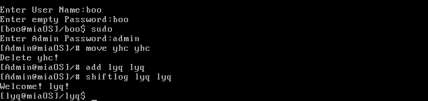
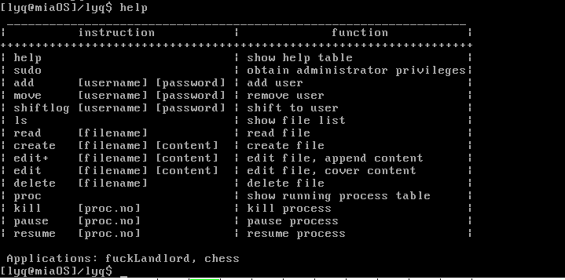
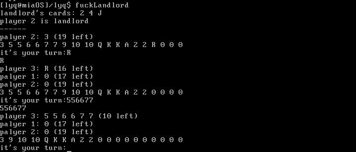
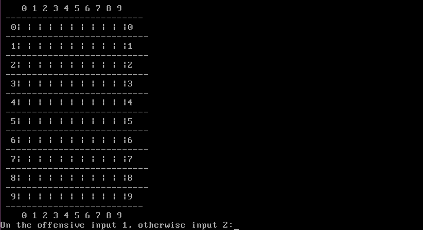
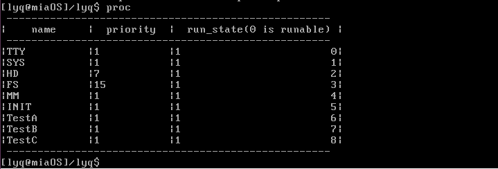
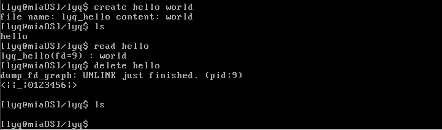

## MiaOS项目文档

### 小组成员

班级号：42028701

1552704 杨灏诚
1552705 林逸群
1552727 李    波

### 一、项目概述

#### 1. 环境配置

- 编写语言：C语言、汇编语言
- 开发环境：ubuntu 12.04（32位），Bochs 2.6
- 运行环境：Mac(Parallel desktop) ，ubuntu

#### 2. 项目基础

- 该项目不是完全由自己搭建的项目，而是在一个已经完成的操作系统上进行了一些添加和修改。参考了操作系统教程的部分代码以及往届学长的部分代码。
- 该项目模拟dos系统，根据输入不同的命令进行不同的操作。同时在文件系统方面，我们学习了ubuntu的多用户文件系统，具有用户和系统两个级别的权限。
- 主要完成的功能有：一个简易的shell、几个用户级应用、文件模块和进程模块。同时我们对进程管理模块做了部分优化，实现了多级优先反馈队列。

#### 3. 项目分数分配

杨灏诚：1/3，林逸群：1/3，李波：1/3

### 二、开发过程

#### 1. 系统工作流程

​	从软盘引导—>在软盘中查找`Loader.bin`—>加载`loader.bin`—>跳转`loader.bin`中的代码开始执  —> 在软盘中查找系统内核`kernel.bin`—>进保护模式 —>加载`kernel.bin`—>跳转`kernel.bin`中的代码开始执  —>更新`GDT` —> 初始化`IDT`—> 初始化`TSS`—>跳入系统主函数 —> 启动系统进程 —>开启时钟中断 —>开始进程调度 —>(系统开始运转)。

#### 2. 进程

##### 进程创建

​	我们知道，系统会创建一个静态的表来记录所有的进程，而表的大小是确定的，所以在一个系统运行的过程中最大可同时运行的进程数量也是确定的。在这个操作系统中，同样也符合这个原理。在`global.h`文件中，有一个`proc_table`记录了所有的进程，它是一个创建的一个宏，如果我们想要创建一个新的进程，首先我们需要修改`proc_table`宏，其次在`kernel_main()`完成他的初始化，在`proc.h`中声明相关的函数即可创建一个新的进程了。	

##### 进程调度

​	调度基础：中断

​	我们在课本原本进程调度的基础上，实现了多级优先反馈队列。通过按照一定的规则来实现对进程的优先级调度。根据课本的描述，以时间片为进程的优先级标准。因此，我们除了为每个进程分配时间片，优先级之外，还记录了进程已经使用过的时间片`run_count`。当进程使用过的时间片占用所进行进程分配时间片的一半的时候，就给指定进程降级并切换进程。我们的优先级队列共分三个等级，为不同类型的进程设计。这样可以有效的避免饥饿问题，解决了时间片为1和时间片为10000两个进程同时竞争时，时间片为1的进程一直得不到资源的问题。但是当一定时间过后，如果多个进程尚未执行结束，会存在多个进程同时处于最低优先级的问题，因此需要在系统运行到一定时间片后，为所有进程重新分配优先级。通过这样一个多级优先反馈队列，可以有效解决进程调度问题。为了让进程可以实现挂起，我们也为进程增添了变量`run_state`。

1. 优先级重排函数

   ```C
   PRIVATE void re_priority(){
       struct proc* p;
       int i=0;
       prio_queue[0].tasklength=0;
       prio_queue[1].tasklength=0;
       prio_queue[2].tasklength=0;
       for(int i=0;i<NR_TASKS+NR_PROCS;i++){
           prio_queue[0].judgequeue[i]=0;
           prio_queue[1].judgequeue[i]=0;
           prio_queue[2].judgequeue[i]=0;
       }
       for (p = &FIRST_PROC; p <= &LAST_PROC; p++) {
           if (i<NR_TASKS) {
               prio_queue[0].taskqueue[prio_queue[0].tasklength] = *p;
               prio_queue[0].judgequeue[prio_queue[0].tasklength] = 1;
               p->position=prio_queue[0].tasklength;
               prio_queue[0].tasklength++;
               p->priority = prio_queue[0].priority;
               p->ticks = 15;
           }
           else{
               prio_queue[1].taskqueue[prio_queue[1].tasklength] = *p;
               prio_queue[1].judgequeue[prio_queue[1].tasklength] = 1;
               p->position=prio_queue[1].tasklength;
               prio_queue[1].tasklength++;
               p->priority = prio_queue[1].priority;
               p->ticks = 10;
           }
           i++;
       }
   }
   ```

2. 时钟中断处理

   ```C
   PUBLIC void clock_handler(int irq)
   {
       int isSparse=0;
       if(ticks%50000==0){
           re_priority();
       }
   	if (++ticks >= MAX_TICKS)
   		ticks = 0;

   	if (p_proc_ready->ticks)
   	   {
   		p_proc_ready->ticks--;
   		p_proc_ready->run_count++;
   		}
       if(p_proc_ready->run_count >= (p_proc_ready->priority*5)/2){
           p_proc_ready->ticks = 0;
           if(p_proc_ready->priority==3){
               prio_queue[0].judgequeue[p_proc_ready->position]=0;
               for(int i=0;i<prio_queue[1].tasklength;i++){
                   if(prio_queue[1].judgequeue[i]==0){
                       prio_queue[1].taskqueue[i] = *p_proc_ready;
                       prio_queue[1].judgequeue[i] = 1;
                       p_proc_ready->position=i;
                       isSparse = 1;
                       break;
                   }
               }
               if(!isSparse){
                   prio_queue[1].taskqueue[prio_queue[1].tasklength] = *p_proc_ready;
                   prio_queue[1].judgequeue[prio_queue[1].tasklength] = 1;
                   p_proc_ready->position=prio_queue[1].tasklength;
                   prio_queue[1].tasklength++;
               }
               p_proc_ready->priority = prio_queue[1].priority;
           }
           else if(p_proc_ready->priority==2){
               prio_queue[1].judgequeue[p_proc_ready->position]=0;
               for(int i=0;i<prio_queue[2].tasklength;i++){
                   if(prio_queue[2].judgequeue[i]==0){
                       prio_queue[2].taskqueue[i] = *p_proc_ready;
                       prio_queue[2].judgequeue[i] = 1;
                       p_proc_ready->position=i;
                       isSparse = 1;
                       break;
                   }
               }
               if(!isSparse){
                   prio_queue[2].taskqueue[prio_queue[2].tasklength] = *p_proc_ready;
                   prio_queue[2].judgequeue[prio_queue[2].tasklength] = 1;
                   p_proc_ready->position=prio_queue[2].tasklength;
                   prio_queue[2].tasklength++;
               }
               p_proc_ready->priority = prio_queue[2].priority;
           }
           else;
           p_proc_ready->run_count = 0;
   	}
   	if (key_pressed)
   		inform_int(TASK_TTY);
   	if (k_reenter != 0) {
   		return;
   	}
   	if (p_proc_ready->ticks > 0) {
   		return;
   	}
   	schedule();
   }
   ```

3. 调度函数

   ```C
   PUBLIC void schedule()
   {
   	struct proc*	p;
   	int		greatest_ticks = 0;

   	while (!greatest_ticks) {
   		for (p = &FIRST_PROC; p <= &LAST_PROC; p++) {
   			if (p->p_flags == 0) {
   				if (p->ticks > greatest_ticks) {
   					greatest_ticks = p->ticks;
   					p_proc_ready = p;
   				}
   			}
   		}
   		if (!greatest_ticks)
   			for (p = &FIRST_PROC; p <= &LAST_PROC; p++)
   				if (p->p_flags == 0)
   					 p->ticks = p->priority * 5;
   	}
   }
   ```

### 三、文件系统及系统权限

​	在文件系统方面，我们参考了Linux的文件系统，用户在使用操作系统时，必须以一定身份进入，即以系统管理员身份进入，或以普通用户身份进入。没有身份则不允许使用操作系统。通过`sudo`命令向系统管理员切换（管理员密码admin），通过`shiftlog`命令进行普通用户间的切换。普通用户可以进行正常的文件操作，而系统管理员可以进行一些更加高级的操作，如增添、删除用户。当权限不够时，系统会作出相应提示。系统磁盘内已经存在两个用户，分别为boo boo，yhc yhc(格式为账号 密码)。因此，在我们的文件系统中，对原课本中的扁平式文件系统做出了拓展，实现了二级文件系统，并且加入了用户级与系统级权限。



### 四、研究成果

| 项目     | 级别   | 类型     |
| ------ | ---- | ------ |
| 斗地主    | 用户级  | 应用程序   |
| 五子棋    | 用户级  | 应用程序   |
| Shell  | 系统级  | 系统调度   |
| 进程管理器  | 系统级  | 系统调度   |
| 文件管理器  | 系统级  | 系统调度   |
| 多级反馈队列 | 内核修改 | 系统结构调整 |

### 五、操作说明

输入账号密码后，进入界面，输入`help`可以查看相关的指令操作。输入应用程序命令，使用应用程序。



#### 1. 用户级应用

- 斗地主(fuckLandlord)

  游戏简介：欢乐斗地主游戏，随机产生地主

  游戏说明：可以和两个电脑进行欢乐斗地主

  游戏操作：地主20张牌，农民17张牌，选0则不出牌，否则按照规则出牌，q退出

  游戏界面预览：



- 五子棋(chess)

  游戏简介：一个五子棋对战游戏

  游戏说明：可以进行人机对战和人人对战

  游戏操作：显示棋盘后，输入坐标完成下棋

  游戏界面预览：



#### 2. 进程管理器

​	输入`proc`查看当前运行的可管理进程，输入`kill proc.no`可以杀死指定进程（不再参与到进程调度），输入`pause proc.no`暂时挂起指定进程，使之参与调度但是不进行任何操作，输入`resume proc.no`重新唤醒指定进程。



#### 3. 文件管理器

​	支持多用户操作，分两级权限管理。文件操作可以进行文件的创建，删除，编辑，读取以及重新写入（通过文件内指针来控制）。



#### 4. 多级优先反馈队列

​	建立了三级优先队列的数据结构，给每个进程有三个等级的等级划分。当某个进程执行时间超过其分配时间片一半时，该进程会被降级。当所有进程都被降至最低级时，需要进行升级操作，因此当分配的时间片超过50000个时间片时，进程会被自动升级。这样既可以避免进程的饥饿问题，也解决了多个初始高优先级进程同时处于最底层的问题。